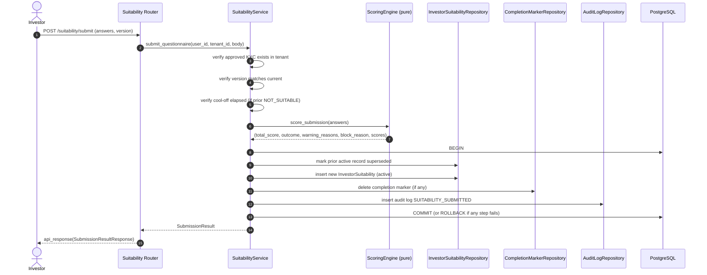
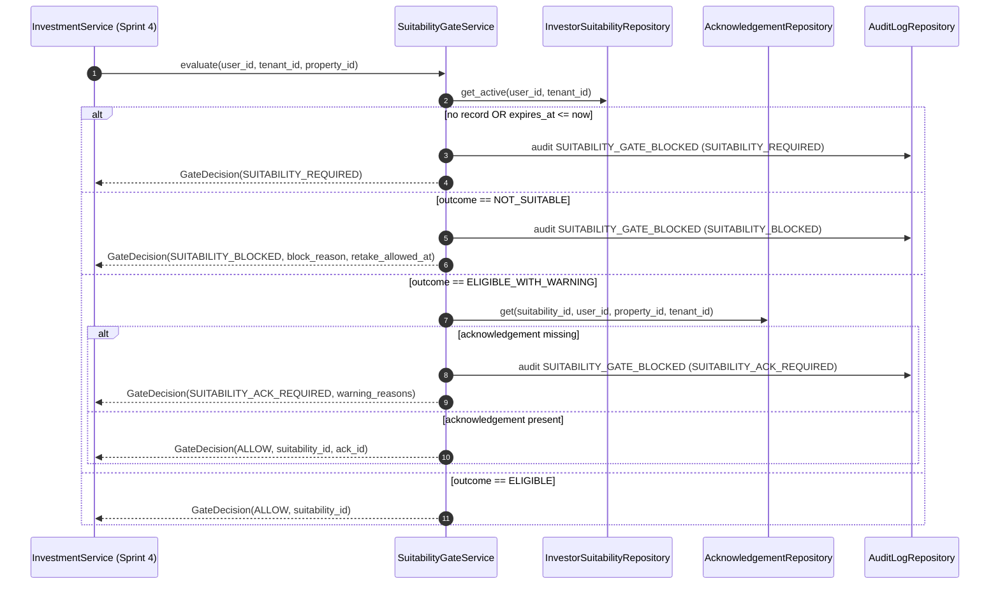
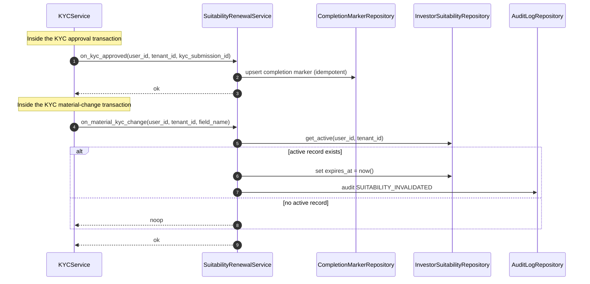
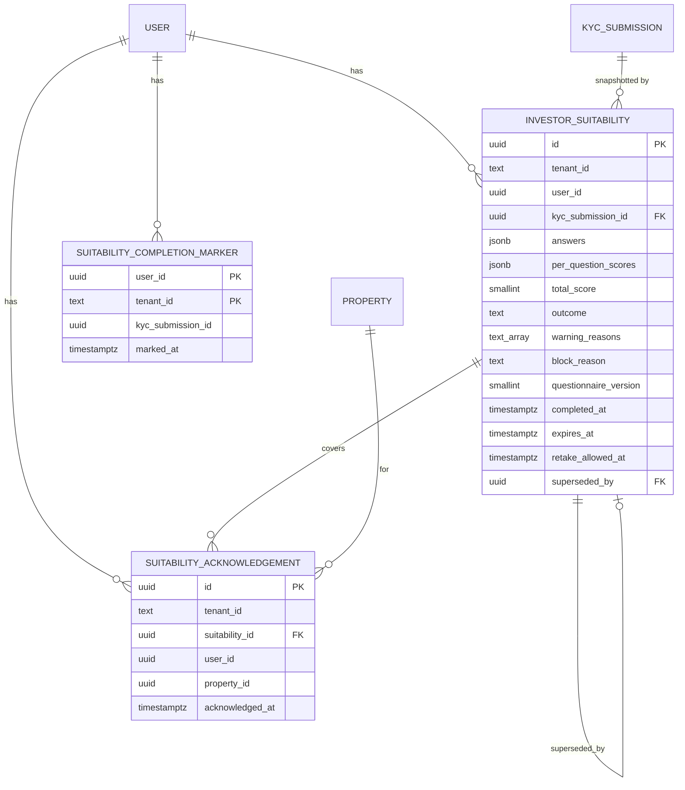

# Design Document — Suitability Questionnaire

## Overview

The Suitability Questionnaire is a regulatory module (DFSA Crowdfunding, DIFC) that determines, before any fractional real estate investment, whether an Investor's financial capacity, horizon, experience, and risk tolerance are compatible with the platform's product. The seven-question questionnaire defined in Appendix A of the requirements is presented after the Investor's first KYC approval and gates every subsequent investment attempt.

The module — `app/modules/suitability_questionnaire/` — is a self-contained part of the modular monolith. It owns three concerns:

1. **Questionnaire lifecycle** — issuing the questionnaire, validating answers, computing a deterministic outcome via the Scoring_Engine, persisting the Suitability_Record, and superseding any prior record.
2. **Investment_Gate** — a synchronous decision function consumed by the Investment module (Sprint 4) that translates the Investor's current Active_Suitability_Record into one of `ALLOW`, `SUITABILITY_REQUIRED`, `SUITABILITY_BLOCKED`, `SUITABILITY_ACK_REQUIRED`, or `INVALID_SUBJECT`.
3. **Renewal and invalidation** — annual expiry handling, the 30-day re-take cool-off after `NOT_SUITABLE`, and KYC-triggered invalidation when nationality or source of funds changes materially.

The Scoring_Engine is implemented as a **pure, side-effect-free Python sub-module** that mirrors the existing `app/modules/kyc/services/constraints_engine/` pattern. Persistence, audit logging, and external module wiring sit one layer above it in `SuitabilityService` and `SuitabilityGateService`. Pure scoring isolation is the key design decision because (a) Appendix A is the authoritative regulatory artefact and must be unit-testable in isolation, and (b) it makes the matrix and outcome thresholds amenable to property-based testing.

The module integrates with four external concerns:

| Concern | Module | Direction |
|---|---|---|
| First-approval trigger and material-change invalidation | `app/modules/kyc` (Sprint 2) | KYC → Suitability via service call |
| Pre-purchase gate | `app/modules/investment` (Sprint 4) | Investment → Suitability via service call |
| State-change audit | `audit_logs` (append-only) | Suitability → Audit via shared repository |
| Renewal email reminders | `app/modules/notification` (Sprint 2) | Suitability → Notification via async queue |

All requirements are scoped per tenant. Every read and write filters by the `X-Tenant-ID` header value, every persisted row carries `tenant_id`, and the `(user_id, tenant_id)` pair is uniquely active for at most one Suitability_Record at a time, enforced by a partial unique index.

## Architecture

### Module placement

```
app/modules/suitability_questionnaire/
├── __init__.py
├── router.py
├── enums/
│   ├── __init__.py
│   ├── suitability_outcome.py            # ELIGIBLE | ELIGIBLE_WITH_WARNING | NOT_SUITABLE
│   ├── question_id.py                    # Q1..Q7
│   ├── net_worth_bracket.py              # Q1 answers
│   ├── annual_income_bracket.py          # Q2 answers
│   ├── allocation_bracket.py             # Q3 answers
│   ├── liquidity_horizon.py              # Q4 answers
│   ├── investment_experience.py          # Q5 answers
│   ├── risk_response.py                  # Q6 answers
│   ├── investment_objective.py           # Q7 answers
│   ├── warning_reason_code.py            # SHORT_HORIZON | HIGH_CONCENTRATION | LOW_EXPERIENCE
│   ├── gate_decision_kind.py             # ALLOW | SUITABILITY_REQUIRED | SUITABILITY_BLOCKED | SUITABILITY_ACK_REQUIRED | INVALID_SUBJECT
│   └── suitability_audit_action.py       # extends AuditAction enum
├── models/
│   ├── __init__.py
│   ├── investor_suitability.py           # core record (one per submission)
│   ├── suitability_acknowledgement.py    # per-property informed consent
│   └── suitability_completion_marker.py  # "questionnaire required" flag set on KYC approval
├── repositories/
│   ├── __init__.py
│   ├── investor_suitability_repository.py
│   ├── suitability_acknowledgement_repository.py
│   └── suitability_completion_marker_repository.py
├── schemas/
│   ├── requests/
│   │   ├── __init__.py
│   │   ├── submit_questionnaire.py
│   │   └── acknowledge_warning.py
│   └── responses/
│       ├── __init__.py
│       ├── questionnaire.py
│       ├── status.py
│       ├── submission_result.py
│       ├── acknowledgement.py
│       └── gate_decision.py
└── services/
    ├── __init__.py
    ├── suitability_service.py            # orchestrator (questionnaire / submit / status)
    ├── suitability_gate_service.py       # Investment_Gate evaluator
    ├── suitability_renewal_service.py    # expiry, KYC invalidation, renewal notifications
    ├── suitability_acknowledgement_service.py
    └── scoring_engine/
        ├── __init__.py                   # re-exports score_submission(...)
        ├── questionnaire_definition.py   # Appendix A: questions, answers, weights, per-answer scores, version
        ├── scorer.py                     # compute_total_score, classify_outcome (pure)
        ├── warning_rules.py              # compute_warning_reasons (pure)
        └── block_rules.py                # compute_block_reason (pure)
```

The `suitability_retake_requests` table created in migration `aec47ab74cb0` is **dropped** by a follow-up migration. The 30-day cool-off is fully represented by `retake_allowed_at` on the `investor_suitability` row, and the historical NOT_SUITABLE rows are inherently retained by the supersession pattern. Keeping a separate retake-request table duplicates state and creates the risk of divergence between two sources of truth.

### Submission flow



### Investment-gate flow



### KYC integration flow



### Layer responsibilities

| Layer | Responsibility | Out of scope |
|---|---|---|
| `router.py` | Parse HTTP, resolve `tenant_id`, call services, return `api_response` envelope. | Business rules, direct repository calls. |
| `services/suitability_service.py` | Questionnaire fetch, submission orchestration, status assembly, transaction boundaries, audit log writes. | Pure scoring, raw SQL. |
| `services/suitability_gate_service.py` | Pure gate decision against the primary DB; structured audit on every block. | Mutating Suitability_Record state. |
| `services/suitability_renewal_service.py` | Annual renewal flagging, KYC-triggered invalidation, renewal notification scheduling. | Sending email (delegates to Notification). |
| `services/scoring_engine/` | Deterministic computation: total score, outcome, warning reasons, block reason. | Database, network, file I/O, clock. |
| `repositories/` | ORM access, partial-unique-index handling, supersession in a single statement. | Business validation. |

## Components and Interfaces

### Scoring Engine (pure)

The Scoring_Engine is the heart of the module and the primary candidate for property-based testing. It exposes one public function and three internal helpers:

```python
# services/scoring_engine/__init__.py
from app.modules.suitability_questionnaire.services.scoring_engine.questionnaire_definition import (
    QUESTIONNAIRE_VERSION,
    QUESTION_DEFINITIONS,
)
from app.modules.suitability_questionnaire.services.scoring_engine.scorer import (
    score_submission,
    ScoringResult,
)

__all__ = ["score_submission", "ScoringResult", "QUESTIONNAIRE_VERSION", "QUESTION_DEFINITIONS"]
```

```python
# services/scoring_engine/scorer.py
from dataclasses import dataclass

@dataclass(frozen=True)
class ScoringResult:
    total_score: int                       # 0..100 inclusive
    per_question_scores: dict[str, int]    # {"Q1": 50, "Q2": 0, ...}
    outcome: SuitabilityOutcome
    warning_reasons: list[WarningReasonCode]   # empty unless ELIGIBLE_WITH_WARNING
    block_reason: str | None                   # populated only when NOT_SUITABLE


def score_submission(answers: dict[QuestionId, str]) -> ScoringResult:
    """Pure function. No DB, no clock, no network. Deterministic in `answers`."""
```

`QUESTION_DEFINITIONS` is a frozen, version-tagged constant table that encodes Appendix A:

```python
# services/scoring_engine/questionnaire_definition.py
QUESTIONNAIRE_VERSION: int = 1

@dataclass(frozen=True)
class QuestionDefinition:
    id: QuestionId
    weight: float                          # 0.10, 0.10, 0.25, 0.30, 0.20, 0.25, 0.10
    answer_scores: dict[str, int]          # {"under_100k": 0, ...}

QUESTION_DEFINITIONS: tuple[QuestionDefinition, ...] = (
    QuestionDefinition(QuestionId.Q1, 0.10, {"under_100k": 0, "between_100k_500k": 50, "over_500k": 100}),
    QuestionDefinition(QuestionId.Q2, 0.10, {"under_50k": 0, "between_50k_200k": 50, "over_200k": 100}),
    QuestionDefinition(QuestionId.Q3, 0.25, {"over_50pct": 0, "between_20_50pct": 50, "under_20pct": 100}),
    QuestionDefinition(QuestionId.Q4, 0.30, {"under_2yr": 0, "between_2_5yr": 50, "over_5yr": 100}),
    QuestionDefinition(QuestionId.Q5, 0.20, {"none": 0, "stocks_bonds": 60, "real_estate": 100}),
    QuestionDefinition(QuestionId.Q6, 0.25, {"sell_immediately": 0, "wait_and_monitor": 60, "buy_more": 100}),
    QuestionDefinition(QuestionId.Q7, 0.10, {"income": 100, "capital_growth": 80, "both": 100}),
)
```

The total score follows Appendix A:

```
weight_sum = sum(qd.weight for qd in QUESTION_DEFINITIONS)         # 1.30
raw        = sum(answer_scores[ans] * qd.weight for ...)          # 0..130
total      = round(raw / weight_sum)                              # 0..100
```

Outcome classification (`scorer.classify_outcome`):

| Total score range | Outcome |
|---|---|
| `>= 65` | `ELIGIBLE` |
| `40..64` | `ELIGIBLE_WITH_WARNING` |
| `< 40` | `NOT_SUITABLE` |

Warning reasons (`warning_rules.compute_warning_reasons`) — only produced when `outcome == ELIGIBLE_WITH_WARNING`:

| Code | Trigger |
|---|---|
| `SHORT_HORIZON` | `Q4 == "between_2_5yr"` and total `< 65` |
| `HIGH_CONCENTRATION` | `Q3 == "between_20_50pct"` |
| `LOW_EXPERIENCE` | `Q5 in {"none", "stocks_bonds"}` |

Block reason (`block_rules.compute_block_reason`) — only produced when `outcome == NOT_SUITABLE`. Exactly one reason via the priority order in Appendix A.4. Block-reason texts are **module-level constants** (not free strings) so they are reproducible verbatim.

### SuitabilityService (orchestrator)

```python
class SuitabilityService:
    def __init__(self, db: AsyncSession, redis_client: Redis):
        self.db = db
        self.redis = redis_client
        self.suitability_repo = InvestorSuitabilityRepository(db)
        self.ack_repo = SuitabilityAcknowledgementRepository(db)
        self.marker_repo = SuitabilityCompletionMarkerRepository(db)
        self.audit_repo = AuditLogRepository(db)
        self.kyc_submission_repo = KYCSubmissionRepository(db)

    async def get_questionnaire(self, user_id: str, tenant_id: str) -> QuestionnaireResponse: ...
    async def get_status(self, user_id: str, tenant_id: str) -> SuitabilityStatusResponse: ...
    async def submit_questionnaire(
        self,
        user_id: str,
        tenant_id: str,
        body: SubmitQuestionnaireRequest,
        ip_address: str,
        user_agent: str,
    ) -> SubmissionResultResponse: ...
```

Submission orchestration runs inside a single `async with self.db.begin()` block. Every step (supersede prior record → insert new record → clear marker → insert audit row) is part of the same transaction. If any step raises, the whole transaction rolls back and the response is an `AppException` subclass — this satisfies Requirements 3.10/3.11/4.10/4.11/7.4/7.5.

### SuitabilityGateService

```python
class SuitabilityGateService:
    def __init__(self, db: AsyncSession):
        self.db = db
        self.suitability_repo = InvestorSuitabilityRepository(db)
        self.ack_repo = SuitabilityAcknowledgementRepository(db)
        self.audit_repo = AuditLogRepository(db)

    async def evaluate(
        self,
        user_id: str,
        tenant_id: str,
        property_id: str,
        ip_address: str | None = None,
        user_agent: str | None = None,
    ) -> GateDecision: ...
```

The gate is **never read from cache** — Sprint-1 product rule "Financial write endpoints always query the primary DB". Each call performs at most two reads (`get_active` + `get_acknowledgement`) and, when the decision is a block, one audit-log insert.

`GateDecision` is a frozen dataclass with a discriminator:

```python
@dataclass(frozen=True)
class GateDecision:
    kind: GateDecisionKind
    suitability_id: str | None = None
    acknowledgement_id: str | None = None
    block_reason: str | None = None
    retake_allowed_at: datetime | None = None
    warning_reasons: tuple[WarningReasonCode, ...] = ()
    reason_indicator: str | None = None    # "NO_RECORD" | "EXPIRED" | "INVALID_SUBJECT"
    property_id: str | None = None
```

### SuitabilityRenewalService

Three responsibilities:

1. `on_kyc_approved(user_id, tenant_id, kyc_submission_id)` — idempotent insert into `suitability_completion_markers` with `ON CONFLICT DO NOTHING`. Called from `KYCService.approve_kyc` inside the same transaction.
2. `on_material_kyc_change(user_id, tenant_id, field_name)` — sets `expires_at = now()` on the active record (if any) and writes `SUITABILITY_INVALIDATED` audit log. No-op when no active record exists. Same-transaction guarantee.
3. `enqueue_renewal_notifications()` — periodic worker that scans active records due for renewal (within 30 days of expiry, or up to 30 days past it), enforcing the **at-most-once-per-24h-per-investor** and **at-most-four-per-record** constraints from Requirement 6.4. Notification dispatch state lives in a small Redis key `sq:renewal:<suitability_id>:count` and `sq:renewal:<suitability_id>:last_at`.

### SuitabilityAcknowledgementService

Handles per-property acknowledgement creation. The repository uses an idempotent insert (`ON CONFLICT (suitability_id, user_id, property_id, tenant_id) DO NOTHING RETURNING *`) so a duplicate POST returns the existing row without raising. This satisfies Requirement 4.5.

### Repositories

`InvestorSuitabilityRepository` — key methods:

```python
async def get_active(self, user_id: str, tenant_id: str) -> Optional[InvestorSuitability]:
    """Return the at-most-one row where superseded_by IS NULL."""

async def get_latest_not_suitable(self, user_id: str, tenant_id: str) -> Optional[InvestorSuitability]:
    """Most recent record with outcome=NOT_SUITABLE, used for cool-off enforcement."""

async def supersede_and_insert(
    self,
    new_record: InvestorSuitability,
    prior_active_id: str | None,
) -> InvestorSuitability:
    """Atomically: UPDATE prior SET superseded_by = new.id; INSERT new. Inside outer transaction."""
```

`SuitabilityAcknowledgementRepository` — uses an `INSERT ... ON CONFLICT DO NOTHING RETURNING *` pattern keyed on `(suitability_id, user_id, property_id, tenant_id)`. Per Requirement 4.4, the table is append-only; the database denies UPDATE/DELETE through RLS (mirroring the `audit_logs`, `governance_votes`, `user_agreements` pattern). The repository never exposes update or delete methods.

`SuitabilityCompletionMarkerRepository` — `mark`, `clear`, and `exists` only.

`AuditLogRepository` — shared utility (already part of the audit-logging infrastructure from Sprint 1). The Suitability module uses it; it does not own it.

### Router endpoints

All routes mounted under `/api/v1/suitability` (registered in `app/api/v1/routes.py`). Routes are role-checked with `RoleChecker(allowed_roles=[UserRole.INVESTOR])`. The `tenant_id` is resolved from the request via `get_current_tenant()` (the existing tenant middleware). Every successful response uses `api_response`. Every error raises an `AppException` subclass.

| Method | Path | Purpose | Returns |
|---|---|---|---|
| `GET` | `/suitability/questionnaire` | Fetch the seven questions plus answer enumerations and the current `questionnaire_version`. | `QuestionnaireResponse` |
| `GET` | `/suitability/status` | Return current state (`SUITABILITY_REQUIRED`, `ELIGIBLE`, `ELIGIBLE_WITH_WARNING`, `NOT_SUITABLE`, due-for-renewal flags, retake-allowed-at, minimum-share-size). | `SuitabilityStatusResponse` |
| `POST` | `/suitability/submit` | Submit answers; returns the resulting outcome plus, for `NOT_SUITABLE`, the block reason and retake-allowed timestamp. | `SubmissionResultResponse` |
| `GET` | `/suitability/properties/{property_id}/acknowledgement` | For an `ELIGIBLE_WITH_WARNING` Investor, return whether an acknowledgement exists for the given property and the current warning reason codes. | `AcknowledgementStatusResponse` |
| `POST` | `/suitability/properties/{property_id}/acknowledge` | Record (or fetch existing) Warning_Acknowledgement for the given property. | `AcknowledgementResponse` |

The Investment_Gate is **not** an HTTP endpoint — it is a Python service consumed in-process by the future Investment module. The status endpoint exposes what the Investor sees on their dashboard; the gate is the authoritative pre-purchase check inside the investment write transaction.

### External integration contracts

```python
# Imported by app/modules/kyc/services/kyc_service.py:
from app.modules.suitability_questionnaire.services import SuitabilityRenewalService

# After KYC is approved, inside the same transaction:
await SuitabilityRenewalService(self.db).on_kyc_approved(user_id, tenant_id, submission.id)

# After a material KYC change is approved, inside the same transaction:
await SuitabilityRenewalService(self.db).on_material_kyc_change(user_id, tenant_id, "nationality")
```

```python
# Imported by app/modules/investment/services/investment_service.py (Sprint 4):
from app.modules.suitability_questionnaire.services import SuitabilityGateService

decision = await SuitabilityGateService(self.db).evaluate(
    user_id=user_id, tenant_id=tenant_id, property_id=property_id,
    ip_address=ip, user_agent=ua,
)
if decision.kind != GateDecisionKind.ALLOW:
    raise SuitabilityGateBlocked(decision)
# proceed with payment / escrow / ledger
```

The investment module never reads `investor_suitability` directly — every gate decision flows through `SuitabilityGateService.evaluate(...)`.

## Data Models

### Tables

#### `investor_suitability` (mutable supersession field, otherwise immutable)

One row per submission. The only column ever updated after insert is `superseded_by` (set when a newer submission supersedes this one) and `expires_at` (set to `now()` by KYC-triggered invalidation). All other fields are write-once. The historical chain of submissions for an Investor is recovered by walking `superseded_by`.

| Column | Type | Notes |
|---|---|---|
| `id` | `UUID` (string) | PK, generated in service. |
| `tenant_id` | `TEXT` | NOT NULL, indexed. Filter on every read/write. |
| `user_id` | `UUID` (string) | NOT NULL, indexed. |
| `kyc_submission_id` | `UUID` (string) | NOT NULL, FK → `kyc_submissions.id`. Snapshot of the approved KYC at submission time. |
| `answers` | `JSONB` | NOT NULL. Map of `Q1..Q7` to enumerated string. |
| `per_question_scores` | `JSONB` | NOT NULL. Map of `Q1..Q7` to integer per-question weighted score. |
| `total_score` | `SMALLINT` | NOT NULL, range `[0, 100]` enforced by check constraint. |
| `outcome` | `TEXT` | NOT NULL. `ELIGIBLE` / `ELIGIBLE_WITH_WARNING` / `NOT_SUITABLE`. |
| `warning_reasons` | `TEXT[]` | NOT NULL, default `'{}'`. Empty list when not `ELIGIBLE_WITH_WARNING`. |
| `block_reason` | `TEXT` | Nullable. Populated only when `outcome == NOT_SUITABLE`. |
| `questionnaire_version` | `SMALLINT` | NOT NULL. |
| `submission_ip` | `INET` | Nullable. |
| `submission_user_agent` | `TEXT` | Nullable. Truncated to 512 chars in service. |
| `completed_at` | `TIMESTAMPTZ` | NOT NULL. UTC, millisecond precision. |
| `expires_at` | `TIMESTAMPTZ` | NOT NULL. `completed_at + INTERVAL '365 days'`. May be set to `now()` by KYC invalidation. |
| `retake_allowed_at` | `TIMESTAMPTZ` | Nullable. `completed_at + INTERVAL '30 days'` only when `outcome == NOT_SUITABLE`. |
| `superseded_by` | `UUID` (string) | Nullable, FK → `investor_suitability.id`. NULL means active. |
| `created_at` | `TIMESTAMPTZ` | NOT NULL, default `now()`. |

Indexes and constraints:

- PK on `id`.
- B-tree index on `(tenant_id, user_id)`.
- B-tree index on `(tenant_id, expires_at)` for the renewal scan.
- **Partial unique index** `unique_active_suitability` on `(tenant_id, user_id) WHERE superseded_by IS NULL`. Enforces Requirement 9.6 at the database level.
- Check constraint `total_score BETWEEN 0 AND 100`.
- Check constraint `(outcome = 'NOT_SUITABLE') = (block_reason IS NOT NULL)`.
- Check constraint `(outcome = 'NOT_SUITABLE') = (retake_allowed_at IS NOT NULL)`.

#### `suitability_acknowledgements` (append-only)

One row per (suitability, user, property, tenant). RLS denies UPDATE and DELETE — same pattern as `audit_logs`.

| Column | Type | Notes |
|---|---|---|
| `id` | `UUID` (string) | PK. |
| `tenant_id` | `TEXT` | NOT NULL, indexed. **Added** (the existing migration omits this column). |
| `suitability_id` | `UUID` (string) | NOT NULL, FK → `investor_suitability.id`, indexed. |
| `user_id` | `UUID` (string) | NOT NULL. |
| `property_id` | `UUID` (string) | NOT NULL. |
| `acknowledged_at` | `TIMESTAMPTZ` | NOT NULL, UTC. |
| `ip_address` | `INET` | Nullable. |
| `user_agent` | `TEXT` | Nullable. |
| `created_at` | `TIMESTAMPTZ` | NOT NULL, default `now()`. |

Constraints:

- Unique key on `(suitability_id, user_id, property_id, tenant_id)` enables `ON CONFLICT DO NOTHING` for idempotent acknowledgement (Req 4.5).
- RLS policy denies `UPDATE` and `DELETE` (Req 4.4) — applied via `init.sql` like `audit_logs`.

#### `suitability_completion_markers`

Small flag table. One row per `(user_id, tenant_id)` indicates the Investor's first KYC approval has set the suitability requirement. Inserted idempotently in the KYC approval transaction, deleted in the submission transaction.

| Column | Type | Notes |
|---|---|---|
| `user_id` | `UUID` (string) | PK part. |
| `tenant_id` | `TEXT` | PK part. |
| `kyc_submission_id` | `UUID` (string) | NOT NULL, snapshot of the triggering KYC. |
| `marked_at` | `TIMESTAMPTZ` | NOT NULL, default `now()`. |

Composite PK `(user_id, tenant_id)` plus `ON CONFLICT (user_id, tenant_id) DO NOTHING` makes the KYC approval call idempotent — Requirement 1.1.

#### Removed: `suitability_retake_requests`

The previously-scaffolded `suitability_retake_requests` table is dropped. The 30-day cool-off is fully encoded by `retake_allowed_at` on the NOT_SUITABLE row, queried via `InvestorSuitabilityRepository.get_latest_not_suitable`. A separate retake-request table introduces a second source of truth and the risk of divergence; its only justification was an "early retake" workflow that is not in any acceptance criterion.

### Entity-relationship diagram



### Pydantic schemas

Request:

```python
class SubmitQuestionnaireRequest(BaseModel):
    questionnaire_version: int = Field(..., ge=1)
    answers: dict[QuestionId, str]   # Pydantic strict mode

class AcknowledgeWarningRequest(BaseModel):
    # property_id is the URL path parameter; body is empty (CSRF-protected)
    pass
```

Response (illustrative):

```python
class SuitabilityStatusResponse(BaseModel):
    state: Literal[
        "SUITABILITY_REQUIRED",
        "ELIGIBLE",
        "ELIGIBLE_WITH_WARNING",
        "NOT_SUITABLE",
    ]
    can_invest: bool
    outcome: Optional[SuitabilityOutcome]
    total_score: Optional[int]
    warning_reasons: list[WarningReasonCode]
    block_reason: Optional[str]
    expires_at: Optional[datetime]
    renewal_due: bool
    renewal_required: bool
    retake_allowed_at: Optional[datetime]
    minimum_share_size_aed: Optional[int]   # populated when state == NOT_SUITABLE
    questionnaire_version: int
    message: str
```

The `state` field always reflects current truth (KYC marker presence, expiry timestamp, outcome) so the client and gate observe a single deterministic shape.

<!-- prework and Correctness Properties go here -->
